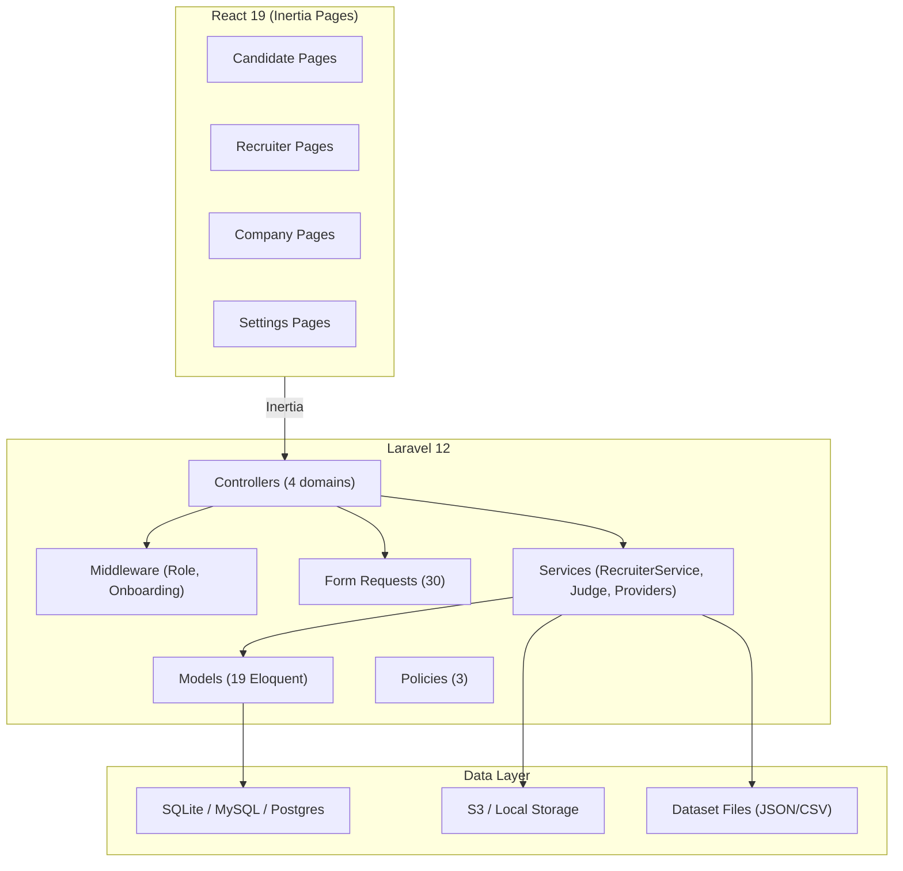

# Codebase Analysis — Internship Portal

## Overview

This is a **role-based recruitment/internship portal** built on **Laravel 12 + Inertia.js v2 + React 19 + Tailwind CSS 4**, using SQLite for local development. The app has four distinct domains — **Candidate**, **Recruiter**, **Company**, and **Assessments** — each with dedicated controllers, pages, service classes, and tests.

---

## Tech Stack

| Layer | Technology |
|-------|-----------|
| Backend | Laravel 12.53, PHP 8.4 |
| Frontend | React 19.2, Inertia.js 2, TypeScript |
| Styling | Tailwind CSS 4 |
| UI Components | Radix UI primitives, Lucide icons, HeadlessUI |
| Auth | Laravel Fortify (2FA, email verification) |
| Code Editor | Monaco Editor (`@monaco-editor/react`) |
| Face Detection | MediaPipe Tasks Vision |
| Routing | Laravel Wayfinder (TS route bindings) |
| Testing | Pest 4 + PHPUnit 12 |
| File Storage | Local + S3 (Flysystem) |
| PDF Parsing | smalot/pdfparser |

---

## Architecture at a Glance



---

## Domain Breakdown

### 1. Candidate Domain
- **Onboarding** flow: multi-step profile completion with photo upload, education, skills, and resume
- **Resume** upload + parsing via `smalot/pdfparser` → skills extraction → skill categorization
- **Company browsing** (only approved/active/public postings) and one-click apply
- **Assessment** taking: MCQ aptitude + coding (LeetCode-style) with Monaco editor

### 2. Recruiter Domain
- **Dashboard** with aggregate statistics (total candidates, starred, by status)
- **Candidate pipeline**: search, filter (by text/status/starred/passed-out/collection), paginate
- **Workflow management**: star toggle, status update (with history), comments (CRUD), collection membership
- **Collections** with parent-child hierarchy (tree with ancestor/descendant queries)
- **Company moderation**: approve/reject company postings, manage visibility
- **Assessment creation**: select topic/difficulty blueprint, auto-builds question set
- **Assessment analytics**: view attempt results, scores, proctoring events

### 3. Company Domain
- **Recruitment management** (CRUD): create postings (pending approval), manage visibility
- **Application review**: view candidate applications, update status, add review notes

### 4. Assessment Domain
- **Two types**: `aptitude` (MCQ) and `coding` (multi-language)
- **Coding judge**: local process-based (Java/Python/JS), sample test runs + hidden grading
- **Proctoring**: MediaPipe face detection + fullscreen enforcement + tab-switch warnings
- **Problem banks**: generated via `php artisan datasets:generate-coding-bank`

---

## Key Metrics

| Category | Count |
|----------|-------|
| Eloquent Models | 19 |
| Controllers | 18 |
| Form Request Classes | 30 |
| Service Classes | 8 |
| Database Migrations | 39 |
| Database Factories | 8 |
| Feature Test Files | 26+ |
| React Pages | 37+ |
| Shared Components | 51 |
| UI Primitives (Radix) | 25 |

---

## File Structure

```
app/
├── Actions/          (4 action classes)
├── Concerns/         (2 traits)
├── Console/          (1 Artisan command)
├── Enums/            (Role, + 1 other)
├── Http/
│   ├── Controllers/  (Auth, Candidate, Company, Recruiter, Settings, Dashboard)
│   ├── Middleware/    (EnsureUserHasRole, EnsureCandidateOnboardingComplete, +2)
│   ├── Requests/     (30 form request classes grouped by domain)
│   ├── Resources/    (3 API resources)
│   └── Responses/    (1 custom response)
├── Jobs/             (1 job class)
├── Models/           (19 Eloquent models)
├── Policies/         (3 policy classes)
├── Providers/        (2 service providers)
├── Services/
│   ├── RecruiterService.php       (475 lines — central recruiter business logic)
│   ├── QuestionProviderService.php (370 lines — assessment question selection)
│   ├── MultiLanguageCodingProblemProviderService.php
│   ├── Java/Python/JavascriptCodingProblemProviderService.php
│   ├── Judge/                     (local code judge)
│   └── Datasets/                  (dataset generation)
└── Support/          (2 helper classes)

resources/js/
├── pages/            (auth, candidate, recruiter, company, settings, dashboard, welcome)
├── components/       (51 shared + 25 UI primitives)
├── hooks/            (7 custom hooks)
├── layouts/          (11 layout components)
├── lib/              (3 utility modules)
├── types/            (7 type definition files)
├── actions/          (Wayfinder action bindings)
├── routes/           (Wayfinder route bindings)
└── app.tsx, ssr.tsx
```

---

## Data Model (19 Models, 39 Migrations)

### Core
- `User` — role-aware identity (candidate / company / admin / super_admin), 15 relationships
- `CandidateProfile` — onboarding data, skills, education, status, photo
- `Resume` — uploaded files with parsed text + extracted skills

### Recruiter Workflow
- `RecruiterCollection` (hierarchical via `parent_id`)
- `RecruiterComment`, `CandidateStatusHistory`
- `CandidateWorkflowStatus` (seeded defaults + custom)
- Pivot: `recruiter_candidate_stars`, `recruiter_collection_candidate`

### Company
- `Company` — postings with approval/visibility lifecycle
- `CompanyApplication` — candidate applications with review notes

### Assessment
- `Assessment`, `AssessmentAssignment`, `AssessmentAttempt`
- `AssessmentQuestion` (MCQ + coding), `AssessmentQuestionOption`, `AssessmentQuestionTestCase`
- `AssessmentResponse`, `AssessmentCodeSubmission`, `AssessmentProctoringEvent`

---

## Access Control

| Mechanism | Purpose |
|-----------|---------|
| `EnsureUserHasRole` middleware | Gate by `Role` enum; `super_admin` bypasses |
| `EnsureCandidateOnboardingComplete` middleware | Redirect incomplete candidates to onboarding |
| 3 Policy classes | Scope recruiter comments, collections, and candidate profiles to owners |
| Controller-level checks | `RecruiterService.assertCandidateIsVisible()`, `assertCollectionAccess()` |

---

## Test Coverage

26+ feature test files covering:

| Area | Files |
|------|-------|
| Auth flows | 7 test files (login, register, verify, password, 2FA) |
| Candidate | Onboarding, Resume, Assessment flow |
| Recruiter | Module behavior (2 files) |
| Company | Enrollment + portal workflow |
| Assessments | Coding assessment, problem banks, provider services, CLI command |
| Settings | Profile, password, 2FA |
| Misc | Dashboard, login redirection, appearance |

---

## Notable Observations

### Strengths
1. **Clean domain alignment**: Routes → Controllers → Pages → Tests all follow the same domain grouping
2. **Consistent validation**: Dedicated `FormRequest` classes (30 total) — no inline validation in controllers
3. **Rich service layer**: `RecruiterService` centralizes complex business logic (475 lines)
4. **Cross-DB compatibility**: `whereJsonArrayContainsInsensitive` handles SQLite/MySQL/Postgres JSON search differences
5. **Good test breadth**: Feature tests cover all major workflows end-to-end
6. **Modern stack**: React 19, Tailwind 4, Vite 7, Pest 4 — all on latest versions
7. **Type safety**: Full TypeScript on the frontend with Wayfinder-generated route bindings

### Areas to Watch

> [!WARNING]
> **The local code judge is not sandboxed.** It runs `javac`, `python3`, `node` directly on the host machine. This is acceptable for local dev but must be replaced with a container/VM-based sandbox before production deployment.

> [!NOTE]
> **`take.tsx` is 2,670 lines** — the largest single file in the codebase. The assessment-taking page handles MCQ rendering, coding editor, judge result display, proctoring (camera + fullscreen + tab detection), timers, and answer persistence. Consider breaking it into smaller, focused components (e.g., `CodingEditor`, `ProctoringOverlay`, `QuestionNavigator`, `TimerBar`).

> [!NOTE]
> **`onboarding.tsx` is ~73 KB** — another very large page component. Like `take.tsx`, extracting sub-components would improve maintainability.

> [!TIP]
> - There are **no unit tests** (only 1 empty file in `tests/Unit/`). Consider adding focused unit tests for `RecruiterService`, `QuestionProviderService`, and the judge layer.
> - No explicit **rate-limiting** on assessment answer submission endpoints — could be abused.
> - No **API routes** in `routes/api.php` — the app is entirely server-rendered Inertia.

---

## Route Summary (125 lines in `web.php`)

| Group | Prefix | Middleware | Routes |
|-------|--------|-----------|--------|
| Public | `/` | none | 1 |
| Candidate (general) | `/candidate`, `/dashboard` | auth, verified, onboarding | ~12 |
| Candidate (assessments) | `/candidate/assessments` | auth, verified, onboarding, role:candidate | ~9 |
| Recruiter | `/recruiter` | auth, role:admin | ~25 |
| Company | `/company` | auth, verified, role:company | ~9 |
| Settings | (imported) | auth | ~6 |

---

## Development Commands

```bash
# Install and run
composer install && npm install
php artisan migrate --seed
composer run dev          # Starts server + queue + pail + vite

# Tests
php artisan test --compact

# Generate coding problem banks
php artisan datasets:generate-coding-bank --count=20

# Build for production
npm run build
```
